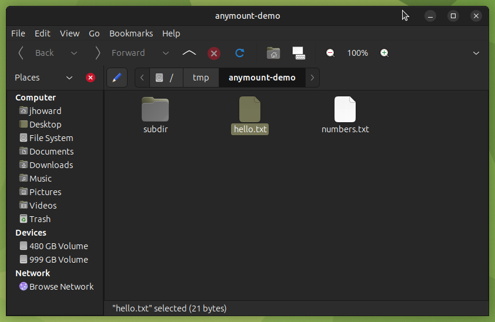
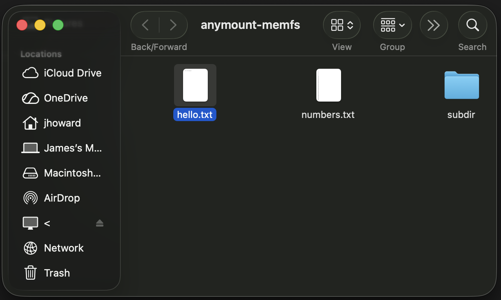
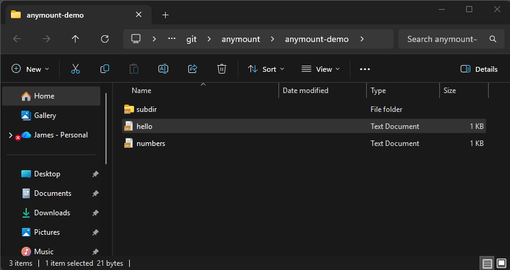

# anymount

This crate mounts a read-only filesystem from user space on Linux, macOS or
Windows. An implementor writes one trait, `ReadOnlyFs`, and the crate mounts it
with a mechanism available on the host OS: FUSE on Linux, an NFSv3
server on macOS, the Cloud Files API on Windows. What appears to the user is an ordinary
directory that `ls`, `cat`, Finder or Explorer read like any other.

It lacks much of what a full filesystem does. Writes report `EROFS`, there are
no symlinks, no extended attributes, no alternate data streams, and `df`
reports an empty volume. In exchange, mounting requires no kernel extension
(except Linux's FUSE), no driver to install, and no administrator privileges.

[](https://crates.io/crates/anymount)
[](https://docs.rs/anymount)
[](https://github.com/jrobhoward/anymount/actions/workflows/ci.yml)

| Linux | macOS | Windows |
|---|---|---|
|  |  |  |

The same in-memory tree from `examples/memfs.rs`, mounted on each platform and
opened in its file manager.

### Documentation

[Module documentation with examples](https://docs.rs/anymount), including the
full `ReadOnlyFs` method list and what each backend does with it.

### Usage

Add `anymount` to `Cargo.toml`, or run `cargo add anymount`. Rust 1.88 or
newer is required.

| OS | Mechanism | What has to be installed |
|----|-----------|--------------------------|
| Linux | FUSE, via the `fusermount3` binary | `fuse3` from the distribution; mounts unprivileged |
| macOS | NFSv3, served by this crate and mounted by the built-in NFS client | nothing: no macFUSE, no kernel extension, no root |
| Windows | Cloud Files (cfapi) | nothing |

`cargo run --example probe` reports which backend a given machine can actually
use, and needs neither a mountpoint nor privileges.

### Usage: implementing the trait

`ReadOnlyFs` has six required methods. Inodes are `u64` and stable for the life
of the mount; the root is always `ROOT_INO`.

```rust
use std::ffi::{OsStr, OsString};
use anymount::{
    DirEntry, FileAttr, FileHandle, FileKind, FsError, Ino, MountBuilder,
    ReadOnlyFs, Result, ROOT_INO,
};

/// A filesystem with one file in it: `/greeting`.
struct Greeting;

const TEXT: &[u8] = b"hello from anymount\n";
const FILE: Ino = Ino(2);

impl ReadOnlyFs for Greeting {
    fn lookup(&self, parent: Ino, name: &OsStr) -> Result<FileAttr> {
        // NFS clients ask for `.` and `..` by name; FUSE resolves them itself.
        match name.to_str() {
            Some(".") | Some("..") => self.getattr(parent),
            Some("greeting") if parent == ROOT_INO => self.getattr(FILE),
            _ => Err(FsError::NotFound),
        }
    }

    fn getattr(&self, ino: Ino) -> Result<FileAttr> {
        match ino {
            ROOT_INO => Ok(FileAttr::dir(ROOT_INO)),
            FILE => Ok(FileAttr::file(FILE, TEXT.len() as u64)),
            _ => Err(FsError::NotFound),
        }
    }

    fn readdir(&self, ino: Ino, offset: u64) -> Result<Vec<DirEntry>> {
        if ino != ROOT_INO {
            return Err(FsError::NotADirectory);
        }
        // `.` and `..` are synthesised by the backend, never returned here.
        // An empty result is what ends the listing, so honour the offset.
        Ok(std::iter::once(DirEntry {
            ino: FILE,
            name: OsString::from("greeting"),
            kind: FileKind::File,
        })
        .skip(offset as usize)
        .collect())
    }

    fn open(&self, ino: Ino) -> Result<FileHandle> {
        if ino == FILE { Ok(FileHandle(1)) } else { Err(FsError::IsADirectory) }
    }

    fn read_at(&self, _fh: FileHandle, offset: u64, buf: &mut [u8]) -> Result<usize> {
        let start = (offset as usize).min(TEXT.len());
        let n = buf.len().min(TEXT.len() - start);
        buf[..n].copy_from_slice(&TEXT[start..start + n]);
        Ok(n)
    }

    fn release(&self, _fh: FileHandle) -> Result<()> {
        Ok(())
    }
}

fn mount_it() -> Result<()> {
    let mount = MountBuilder::new("/tmp/greeting")
        .fs_name("greeting")
        .mount(Greeting)?;

    println!("mounted at {}", mount.mountpoint().display());
    mount.unmount()
}
```

`listxattr`, `getxattr`, `statfs` and `forget` have harmless defaults,
so an implementation only overrides what it has answers for.

The same code mounts on all three platforms. `MountBuilder` picks the backend
from the target, and the options a backend cannot honour are rejected at
`mount()` rather than ignored — `allow_other`, `auto_unmount` and `threads`
are FUSE-only, and asking for one elsewhere is an error.

### Usage: unmounting

Dropping the `Mount` tears the mount down. Calling `unmount()` does the same
thing and returns the errors that dropping discards. Either will succeed on a mount
the OS has already taken down, so ejecting the volume first costs nothing.

An unmount the OS starts is not reported back. Ejecting in Finder, or running
`umount` or `fusermount3 -u`, takes the mount down at any time; the server
behind it keeps running until the `Mount` is dropped, and there is no query or
callback for the mount having gone. A process killed by a signal may leave the
mount in place instead, since `Drop` does not run.

### Scope: What it does not do

1.0 is feature-complete. None of the limits below were needed for the crate's
original use case, so none are planned for a 1.x release.  A version that adds
one would likely be 2.0, since the value types are not `#[non_exhaustive]`.
[`docs/GAPS.md`](docs/GAPS.md) catalogues every limitation, why it exists, and
what changing it would cost.

- Read-only. Write operations report `EROFS`.
- No extended attributes beyond `listxattr`/`getxattr`'s harmless defaults,
  and no Windows alternate data streams.
- No symlinks or hardlinks: `FileKind` has only `File` and `Directory`.
- No filesystem size. The default `statfs` reports zeroed counters, so `df`
  shows an empty volume; an implementation that knows its own size can
  override it, and on Windows nothing asks.
- The trait is synchronous. Concurrency comes from serving requests on several
  threads, not from async.
- `read_at` takes an offset, but only FUSE issues random reads. cfapi fetches a
  whole file on first touch. An archive that can only decode from byte 0 should
  materialise on open and serve reads from a cache.
- Windows gets a directory, not a drive letter, and that directory must be
  empty. cfapi projects its entries into the mountpoint rather than covering
  it, and clears them again on unmount, so mounting over existing files would
  destroy them; `mount()` refuses rather than risk it.
- On macOS, a mount that falls back to loopback TCP is reachable by any local
  account. See the transport comparison below.

### Crate features

| Feature | Default | Effect |
|---|---|---|
| `fuse` | yes | FUSE backend. Linux only; compiles to nothing elsewhere |
| `nfs` | yes | NFS backend. macOS only; needs no dependency of its own |
| `nfs-local-socket` | yes | NFS over an `AF_UNIX` socket. Implies `nfs` |
| `nfs-tcp` | yes | NFS over loopback TCP, run through `mount_nfs`. Implies `nfs` |
| `cfapi` | yes | Cloud Files backend. Windows only |
| `tracing` | no | Logs mounts, unmounts and the errors a backend has to discard |

All three backends default on because cargo cannot express a per-OS default.
The platform dependencies are `cfg`-scoped, so a Linux build never fetches the
`windows` crate.

### Crate features: choosing a macOS NFS transport

The two transport features trade how private a mount is against how much of the
mechanism macOS documents. Both are on by default, which tries the local socket
first and falls back to loopback TCP.

| Features | Mount is private to the mounting user | Documented interfaces only | If the private encoding breaks |
|---|---|---|---|
| `nfs-local-socket`, `nfs-tcp` | when the local socket is used | no | falls back to TCP |
| `nfs-local-socket` alone | yes | no | mount fails |
| `nfs-tcp` alone | no | yes | not applicable |

`nfs-local-socket` passes the root file handle to `mount(2)` in an argument
buffer whose layout macOS does not document, so the MOUNT protocol never runs,
nothing listens on the network, and socket permissions decide who may connect.
Nothing is compiled against a private header — the constants are transcribed,
and the only libc calls are `mount(2)` and `unmount(2)` — so a macOS that
changes the encoding costs a failed mount, not a failed build. `nfs-tcp` runs
`/sbin/mount_nfs` with documented options instead, and pays for that in
reachability: its export path reaches the system mount table and `nfsstat -m`,
where any local account can read it. [`docs/GAPS.md`](docs/GAPS.md) has both in
full.

Turning `nfs-tcp` off does not guarantee its absence, because cargo features
unify — another crate in the dependency graph enabling it brings the fallback
back for everyone. `MountBuilder::nfs_require_local_socket` is the guarantee,
and it cannot be overridden from outside. `Mount::nfs_uses_local_socket`
reports which transport a live mount got.

`nfs` with neither transport is a compile error rather than a backend that
cannot mount.

### Try it

```sh
mkdir -p /tmp/anymount-demo
cargo run --example probe                          # what can this machine mount?
cargo run --example memfs -- /tmp/anymount-demo    # mount a small in-memory tree
```

Then, from another shell:

```sh
ls -lR /tmp/anymount-demo
cat /tmp/anymount-demo/hello.txt
sha256sum /tmp/anymount-demo/numbers.txt   # matches `seq 1 100 | sha256sum`
```

Adding `--open` to the `memfs` line also pops a file-manager window at the
mount root, which is how the screenshots above were taken.

### Opening the mount in a file manager

A mount is never relocated: `Mount::mountpoint()` is always exactly the path
given to `MountBuilder::new`, on all three backends. There is no
`/Volumes`-style OS-injected location to look up, so opening a native window at
that path is a one-line job left to the caller.

```rust,ignore
let mount = MountBuilder::new("/mnt/restore").mount(my_fs)?;
opener::open(mount.mountpoint())?;
```

`examples/memfs.rs` does this behind its `--open` flag; `opener` is a
dev-dependency of the example, not of the library.

### Why three backends, not one mechanism everywhere

Nothing in Rust spans all three platforms behind one API — the nearest
equivalent in any language is Go's `cgofuse`, which does not cover Windows. So
each platform gets the mechanism that fits it rather than a lowest common
denominator: FUSE on Linux, a from-scratch NFSv3 server on macOS (FUSE there
needs a kernel extension, and WebDAV made Finder download a whole file on every
folder view), and the Cloud Files API on Windows (ProjFS was evaluated but set
aside). [`docs/ARCHITECTURE.md`](docs/ARCHITECTURE.md) has the reasoning for
each.

All three mount, read and unmount, and each is exercised against a real mount
in CI on its own platform — `ls`, `cat`, `find`, and a checksum compared
against one computed outside the mount.

### Development

```sh
cargo test
cargo clippy --all-targets -- -Dwarnings
cargo fmt --all -- --check
cargo deny check licenses bans sources advisories

# Type check the other platforms' backends without their toolchains
cargo clippy --target x86_64-pc-windows-msvc --all-targets -- -Dwarnings
cargo check --target aarch64-apple-darwin --all-targets

# The declared MSRV floor, which a drifting stable toolchain will not catch
cargo +1.88.0 check --all-targets
```

[`docs/ARCHITECTURE.md`](docs/ARCHITECTURE.md) covers the module layout and
design rationale; [`CLAUDE.md`](CLAUDE.md) records the conventions and platform
constraints a contributor needs before editing a backend.

### Minimum Rust version policy

The minimum supported `rustc` version is 1.88.0, declared as `rust-version` in
`Cargo.toml` and checked by a CI job pinned to that exact toolchain. The policy
is that the minimum can rise in a minor version update.

### License

This project is licensed under either of

 * Apache License, Version 2.0, ([LICENSE-APACHE](LICENSE-APACHE) or
   https://www.apache.org/licenses/LICENSE-2.0)
 * MIT license ([LICENSE-MIT](LICENSE-MIT) or
   https://opensource.org/licenses/MIT)

at your option.
