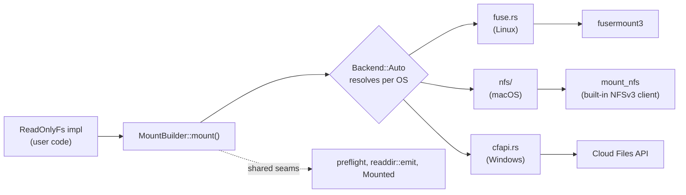

# Architecture

How `anymount` is put together, and why it looks this way. For what it does
and does not do, see `README.md` and `docs/GAPS.md`; for what changed in each
release, see `CHANGELOG.md`.

## Overview

One trait, `ReadOnlyFs`, implemented once by whatever is being mounted. The
crate serves it through whichever mechanism the host OS provides — there is
no shared cross-platform mount layer, just one backend per OS behind a common
seam.

`preflight` (capability checks), `readdir::emit` (paginated listing), and the
`Mounted` trait (unmount-on-drop) are written once and shared by all three
backends rather than reimplemented per platform.

## Module map

| Module | Holds |
|---|---|
| `fs.rs` | The `ReadOnlyFs` trait: `lookup`, `getattr`, `readdir`, `open`, `read_at`, `release`, plus default-implemented `listxattr`, `getxattr`, `statfs`, `forget`. |
| `types.rs` | `Ino`, `FileHandle`, `FileAttr`, `DirEntry`, `FileKind`, `StatFs`. |
| `error.rs` | `FsError`, mapped to `errno` on every platform and to `HRESULT`/`NTSTATUS` on Windows. |
| `mount.rs` | `MountBuilder` and `Mount`. `Mount` unmounts on drop. |
| `backend/mod.rs` | Resolves `Backend::Auto` to a platform backend. |
| `backend/preflight.rs` | `Caps` (what a backend can honor) and the checks run before any platform code. |
| `backend/readdir.rs` | Cookie arithmetic and `emit`, the paginated-listing driver shared by all three backends. |
| `backend/trace.rs` | `backend_warn!`/`backend_info!`, no-ops without the `tracing` feature. |
| `backend/fuse.rs` | Linux backend, via `fusermount3`. |
| `backend/nfs/` | macOS backend: a from-scratch NFSv3 server (`xdr.rs`, `rpc.rs`, `mount_proto.rs`, `nfs_proto.rs`, `handle.rs`, `server.rs`) mounted with the OS's own `mount_nfs`. Only `mod.rs`'s `mount` and `NfsHandle` are macOS-gated; the wire layer builds and tests on any Unix. |
| `backend/cfapi.rs` | Windows backend, via the Cloud Files API. |

## Why three backends, not one mechanism

No single library spans FUSE, NFS, and cfapi behind one API — the nearest
cross-platform equivalent in any language is Go's `cgofuse`, which does not
cover Windows. Per OS:

- **Linux** — FUSE, through `fusermount3` rather than linking libfuse
  directly (keeps LGPL out of the link, and allows unprivileged mounts).
- **macOS** — a from-scratch NFSv3 server, not FUSE. FUSE (via macFUSE)
  needs a kernel extension, which on Apple Silicon requires lowering boot
  security; WebDAV (`mount_webdav`) made Finder download a whole file on
  every folder view. Both were evaluated and set aside in favor of an
  unprivileged NFS server mounted with the OS's built-in client — no
  extension, no root, no boot-security change. See `docs/GAPS.md` for the
  FSKit finding that ruled out the other kext-free option.
- **Windows** — the Cloud Files API (cfapi), not ProjFS. Both hydrate
  through the same NTFS mechanism and neither supports writes, so neither
  was uniquely capable for this crate's read-only scope; cfapi needs no
  one-time admin feature enable and avoids materializing whole files on
  local disk the way ProjFS does. WinFsp and Dokan mount a real drive letter
  but are GPL-licensed — see the licensing table below.

## Design constraints

Three properties of the trait follow from the crate's original consumer (a
personal project mounting an encrypted, immutable archive for browsing) and
are unlikely to change without a new consumer forcing the question:

- **Synchronous, not async.** Concurrency comes from serving requests on
  several threads, not from an async runtime.
- **No symlinks or hardlinks.** `FileKind` has only `File` and `Directory`.
- **`read_at` takes an offset, but only FUSE issues genuinely random reads.**
  cfapi always fetches a whole file sequentially; an implementation backed by
  a format that cannot seek should materialise on `open` and serve reads from
  a cache. The trait does not need to change if true streaming becomes
  possible later.

## Platform constraints

One line each; see the named module's rustdoc or `docs/GAPS.md` for detail.

- `allow_other`, `auto_unmount`, and `threads` are FUSE-only builder options;
  `preflight` rejects them elsewhere by name rather than ignoring them.
- cfapi requires an empty mountpoint and only deletes entries it created
  (`FILE_ATTRIBUTE_REPARSE_POINT`) on unmount.
- cfapi's placeholder descriptors (`CF_PLACEHOLDER_CREATE_INFO`) are raw
  pointers with no lifetime; `Placeholders::with_descriptors` keeps their
  backing store alive for exactly the `CfExecute` call that reads them.
- `ReadOnlyFs::readdir` may return a partial page; an empty page is the only
  end-of-directory signal, and `backend/readdir.rs`'s `emit` is the only
  code allowed to call `readdir` directly.
- NFS authorizes with a random per-mount secret embedded in every file
  handle, not `AUTH_SYS` (an unprivileged client can claim any uid/gid over
  `AUTH_SYS`, so it verifies nothing). The mount binds to `127.0.0.1` only.
- NFS mounts `soft` with a short `timeo`/`retrans` rather than classic `hard`
  semantics, so a crashed server times out in seconds instead of hanging
  every read behind a modal dialog.
- NFS's RPC framing supports only single-fragment messages; a client that
  needs reassembly is not supported (see `docs/GAPS.md`).

## Licensing

MIT OR Apache-2.0, with no copyleft anywhere in the dependency graph —
enforced in CI by `cargo deny check licenses bans sources advisories` and by
`deny.toml`'s ban list.

| Avoided | Licence | Used instead |
|---|---|---|
| `winfsp`, `winfsp-sys` | GPL-3.0 | nothing; WinFsp is out of scope |
| `windows-projfs` | GPL-2.0 | Microsoft's own `windows` crate |
| `dokan`, `dokan-sys` | wrap LGPL Dokany | cfapi |
| libfuse (linked) | LGPL | `fusermount3` on Linux |

## Status

1.0 is feature-complete: all three backends mount, read, and unmount, each
exercised against a real mount in CI on its own platform. See
`docs/GAPS.md` for known limitations and `CHANGELOG.md` for release history.
