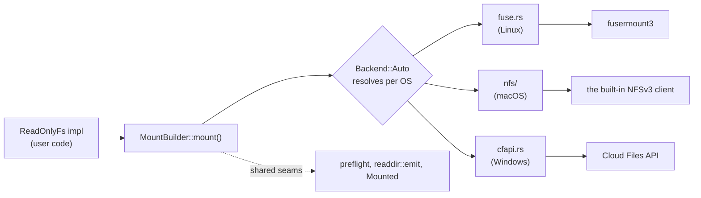
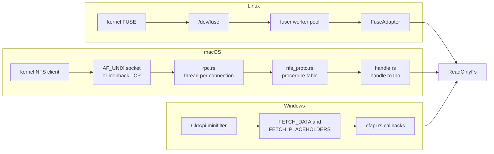
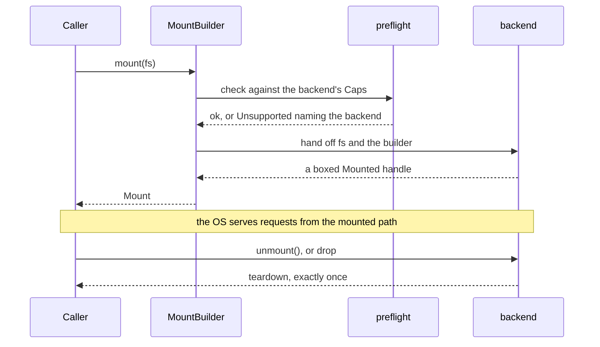

# Architecture

How `anymount` is put together, and why it looks this way. For what it does
and does not do, see `README.md` and `docs/GAPS.md`; for what changed in each
release, see `CHANGELOG.md`.

## Overview

One trait, `ReadOnlyFs`, implemented once by whatever is being mounted. The
crate serves it through whichever mechanism the host OS provides — there is
no shared cross-platform mount layer, just one backend per OS behind a common
seam.

`preflight` (capability checks), `readdir::emit` (paginated listing), and the
`Mounted` trait (unmount-on-drop) are written once and shared by all three
backends rather than reimplemented per platform.

## Module map

| Module | Holds |
|---|---|
| `lib.rs` | Crate root and re-exports, plus `probe`: `any_backend_available`, and `cfapi`/`PlatformInfo` on Windows. |
| `fs.rs` | The `ReadOnlyFs` trait: `lookup`, `getattr`, `readdir`, `open`, `read_at`, `release`, plus default-implemented `listxattr`, `getxattr`, `statfs`, `forget`. |
| `types.rs` | `Ino`, `FileHandle`, `FileAttr`, `DirEntry`, `FileKind`, `StatFs`. |
| `error.rs` | `FsError`. `to_errno` is public, with a `cfg(unix)`/`cfg(not(unix))` pair behind it; `to_ntstatus` is internal to the cfapi backend. |
| `mount.rs` | `MountBuilder` and `Mount`. `Mount` unmounts on drop. |
| `backend/mod.rs` | Resolves `Backend::Auto` to a platform backend, and defines `Mounted`. |
| `backend/preflight.rs` | `Caps` (what a backend can honour) and the checks run before any platform code. |
| `backend/readdir.rs` | Cookie arithmetic and `emit`, the paginated-listing driver shared by all three backends. |
| `backend/trace.rs` | `backend_warn!`/`backend_info!`, no-ops without the `tracing` feature. |
| `backend/fuse.rs` | Linux backend, via `fusermount3`. |
| `backend/nfs/` | macOS backend: a from-scratch NFSv3 server, mounted by the OS's own NFS client. Wire layer in `xdr.rs`, `rpc.rs`, `mount_proto.rs`, `nfs_proto.rs`, `handle.rs`, `transport.rs`, `server.rs`; the two transports in `local.rs` and `tcp.rs`, with `mount_args.rs` encoding the `mount(2)` argument buffer the first needs. |
| `backend/cfapi.rs` | Windows backend, via the Cloud Files API. |

Only `local.rs`, `tcp.rs` and `NfsHandle` are macOS-gated — the parts that call
`mount(2)`, run `mount_nfs`, and call `libc::unmount`. The wire layer and the
argument encoder are byte manipulation with no platform API in them, so they
compile and test on every Unix, which is how the NFS backend is unit-tested
away from a Mac. Each carries a scoped `dead_code` allow off macOS rather than
the module carrying a blanket one.

## The request path

Mount dispatch is the same shape everywhere; serving a request is not. A read
on the mounted path reaches the same `read_at` by three different routes, and
the differences account for most of what the backends do not share.

On Linux the kernel does the protocol work. `fuser` reads requests from
`/dev/fuse` on a worker pool and calls `FuseAdapter`, which turns each one into
a trait call. Inode numbers arrive as themselves, so there is no handle layer.

On macOS the crate is the protocol. `server.rs` runs an accept loop and spawns
a worker per connection; `rpc.rs` reads one ONC RPC message per iteration;
`server.rs` routes on program and version, sending `MOUNT` to `mount_proto.rs`
and NFS to `nfs_proto.rs`. That last is a procedure table indexed by NFSv3
procedure number, and it is where read-only is enforced: `WRITE3`, `CREATE3`,
`MKDIR3` and the rest map to `reject_rofs_*` arms sitting beside the ones that
do work, so no write reaches the trait by way of a procedure nobody
implemented. Requests carry opaque NFS file handles rather than inode numbers,
so `handle.rs` resolves each back to an `Ino` before the trait sees it.

On Windows the platform calls the crate. `CfConnectSyncRoot` registers a
callback table with two entries, and the CldApi minifilter invokes them on its
own threads: `FETCH_PLACEHOLDERS` when a directory is enumerated, `FETCH_DATA`
when file content is first touched. There is no request loop the crate owns,
and no thread it started.

All three reach `readdir` through `backend/readdir.rs`'s `emit`, the only code
permitted to call `ReadOnlyFs::readdir` directly. FUSE and NFS pass
`Dots::Synthesize`, since both protocols expect `.` and `..` in a listing;
cfapi passes `Dots::Omit`, because placeholder enumeration has no equivalent.

## Lifecycle and ownership

`MountBuilder::mount` runs `preflight::check` against the chosen backend's
`Caps` before any platform code, so an option the backend cannot honour is an
error naming the backend rather than a silent no-op. The backend then returns
a boxed `Mounted`, which `Mount` owns. Teardown runs exactly once, from
whichever of `unmount` or `drop` comes first, because the handle is consumed —
so unmount-on-drop is a promise `Mount` makes rather than a side effect of
whatever library is underneath. A `Mounted` implementation must leave nothing
running that would outlive the process: joining a worker is part of teardown.

The trait is called concurrently on every backend, which is why `ReadOnlyFs`
requires `Send + Sync`. Where that concurrency comes from differs, and so does
who owns the implementation:

| Backend | Threads calling the trait | Ownership |
|---|---|---|
| FUSE | `fuser`'s worker pool, sized by `MountBuilder::threads` | `Arc<F>` in `FuseAdapter`, shared with the pool |
| NFS | one per connection, capped at `MAX_CONNECTIONS` | `Arc<F>`, cloned into each worker |
| cfapi | the platform's, on callbacks the crate does not schedule | a plain `F`; nothing shares ownership |

## Why three backends, not one mechanism

No single library spans FUSE, NFS, and cfapi behind one API — the nearest
cross-platform equivalent in any language is Go's `cgofuse`, which does not
cover Windows. Per OS:

- **Linux** — FUSE, through `fusermount3` rather than linking libfuse
  directly (keeps LGPL out of the link, and allows unprivileged mounts).
- **macOS** — a from-scratch NFSv3 server, not FUSE. FUSE there goes through
  macFUSE, which needs a third-party kernel extension: on Apple Silicon there
  is no click-through approval for one, and allowing it means booting into
  Recovery Mode and lowering the machine's boot security policy — a standing
  change to the machine, not a one-time click. WebDAV (`mount_webdav`) needs
  no extension but made Finder download a whole file on every folder view.
  Both were set aside in favour of an unprivileged NFS server mounted with the
  OS's built-in client: no extension, no root, no boot-security change, and no
  code signing as a prerequisite. See `docs/GAPS.md` for the FSKit finding
  that ruled out the other kext-free option.
- **Windows** — the Cloud Files API (cfapi), not ProjFS. Neither is uniquely
  capable for a read-only crate: both hydrate through the same NTFS
  reparse-point and minifilter mechanism, both fetch callbacks
  (`PrjGetFileDataCallback` and `CF_CALLBACK_TYPE_FETCH_DATA`) take an
  offset and length, and ProjFS cannot intercept writes at all. ProjFS carries
  two costs cfapi does not. Reading a file through it materializes the file on
  local disk with no automatic eviction, so browsing a large archive can fill
  the volume, where cfapi's `STREAMING_ALLOWED` policy avoids persisting
  fetched data and `AUTO_DEHYDRATION_ALLOWED` lets Storage Sense reclaim it.
  And ProjFS needs a one-time admin step to enable the `Client-ProjFS`
  optional feature, where `CldApi.dll` ships enabled on every Windows 10
  1709 or newer install and `CfRegisterSyncRoot` works from an unpackaged
  binary. `docs/GAPS.md` records the dynamic-linking constraint that would
  apply to a ProjFS backend regardless. WinFsp and Dokan mount a real drive
  letter but are GPL-licensed — see the licensing table below.

## Seams and invariants

Four things hold across backends. A new backend supplies a `mount` function, a
`Mounted` impl and a `Caps`; it does not add a fourth policy to any of these.

- **`Caps` declares what a backend can honour**, and `preflight::check` is the
  only place a builder option is accepted or refused. `allow_other`,
  `auto_unmount` and `threads` are FUSE-only, and asking for one elsewhere is
  an error naming the backend.
- **`readdir::emit` is the only caller of `ReadOnlyFs::readdir`.** An
  implementation may return a partial page, and an empty page is the only
  end-of-directory signal, so a backend that called `readdir` itself and
  treated one page as the whole tail would report a truncated directory with
  no error to show for it.
- **`Mounted` owns teardown**, and it runs once. That is what lets `Mount`
  promise unmount-on-drop uniformly over three mechanisms with three different
  native teardown stories.
- **NFS authorizes with a secret in the file handle, not `AUTH_SYS`.** An
  unprivileged client can claim any uid or gid over `AUTH_SYS`, so it verifies
  nothing. `handle.rs` puts a per-mount random value in every handle the server
  hands out, and a second, independent value authorizes `MNT`. `docs/GAPS.md`
  covers what each one does and does not protect.

Details that matter when editing one backend — the `mount(2)` argument buffer,
cfapi's placeholder descriptor lifetimes, the `soft` mount options,
single-fragment RPC framing — live in the relevant module's rustdoc, with the
rules for changing them in `CLAUDE.md` and the consequences in `docs/GAPS.md`.

## Licensing

MIT OR Apache-2.0, with no copyleft anywhere in the dependency graph —
enforced in CI by `cargo deny check licenses bans sources advisories` and by
`deny.toml`'s ban list. The obvious binding for each of these platform APIs is
copyleft, so the licence constraint is part of why each backend looks the way
it does.

| Avoided | Licence | Used instead |
|---|---|---|
| `winfsp`, `winfsp-sys` | GPL-3.0 | nothing; WinFsp is out of scope |
| `windows-projfs` | GPL-2.0 | Microsoft's own `windows` crate |
| `dokan`, `dokan-sys` | wrap LGPL Dokany | cfapi |
| libfuse (linked) | LGPL | `fusermount3` on Linux |
